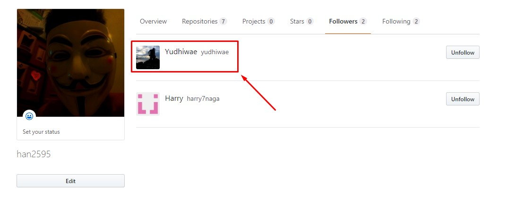
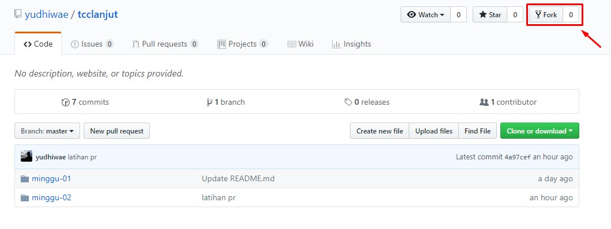
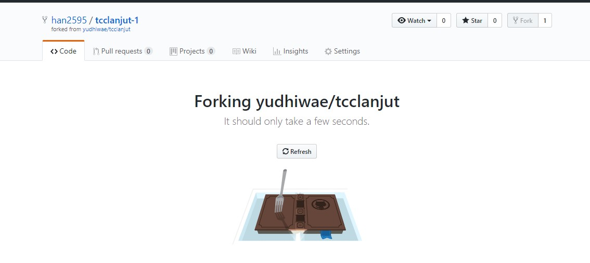
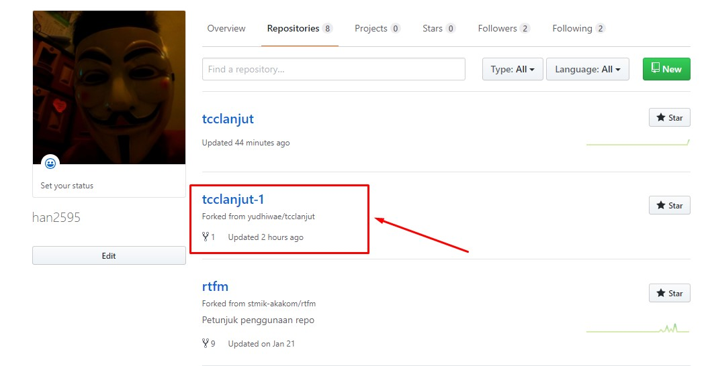
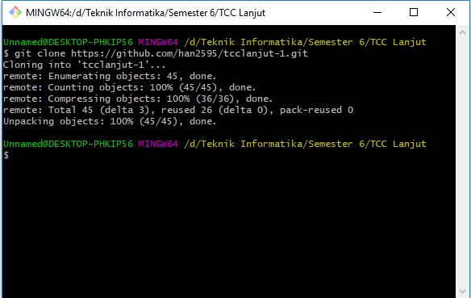
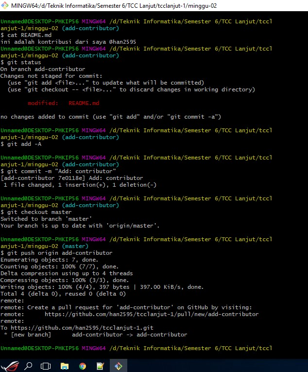
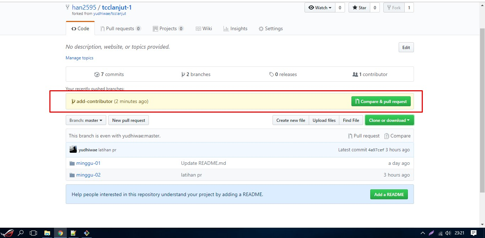
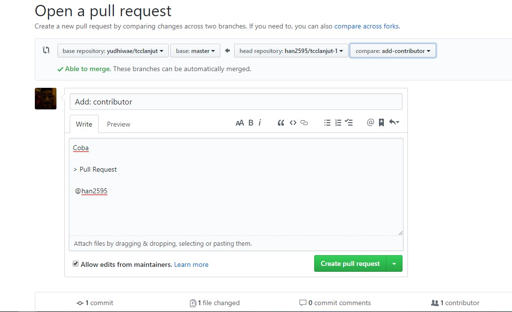
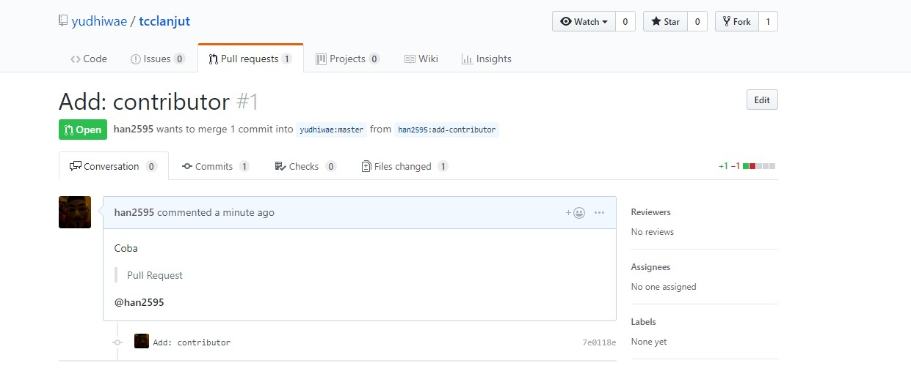
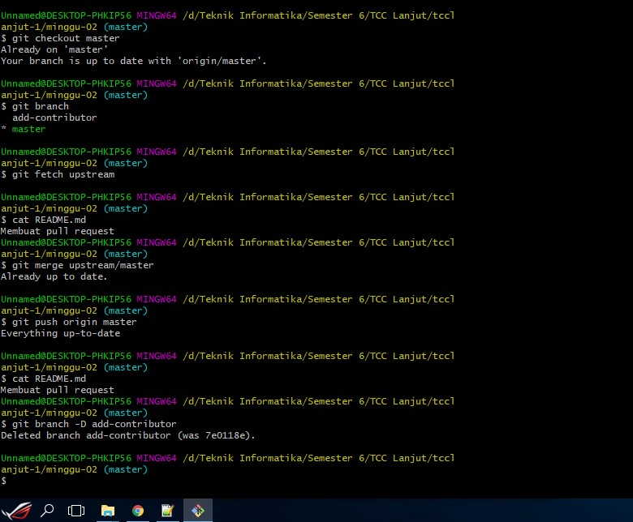

# tcclanjut minggu-02
# Pull Request-02

Melakukan Pull Request di GitHub
Pull-request merupakan fitur yang memungkinkan kita memberitahukan kepada para pengembang 
di pusat bahwa kita memiliki perubahan yang ingin dikirimkan ke mereka.
 Tombol pull-request ada pada kiri atas repositori:
 
1.Yang pertama dilakukan adalah mencari teman atau partner untuk berkolaborasi 

 
2.Setelah itu Mengambil Kode dari pemilik repo atau biasa disebut Fork 
 
 
 
3.Kemudian proses forking berlangsung dan tunggu hingga selesai 

 
4.Kemudian jika forking berhasil , ketika kita kembali ke repo milik kita akan terdapat repo milik teman yang sudah kita fork , dalam kasus ini "tcclanjut-1"

 
5.Setelah itu kita akan meng Clone repo tersebut ke komputer lokal 

6.Kemudian mengkonfigurasi repo lokal kontributor gunanya  untuk memudahkan kita dalam memastikan perubahan yang dilakukan tidak mengalami konflik dengan kontributor lainnya

origin: menunjuk ke repo milik kontributor di GitHub, hasil dari fork.

upstream: menunjuk ke repo milik upstream author (repo asli) dan inilah yang akan kita konfigurasi 
 

kemudian kita lakukan pengecekan dengan cara mengetikan'$ git remote -v' di git bash

7.Nah pada poin ini kita akan melakukan perubahan atau mengirim kontribusi ke repo milik si pemilik dalam kasus ini repo dari teman saya 'yudhiwae'
 tapi sebelum itu pastikan bahwa isi repo lokal tersinkronisasi dengan repo dari upstream author.

 
 ini adalah perubahan yang saya lakukan di repo milik 'yudhiwae' mungkin terlihat simple , tapi kembali lagi ini hanya sedikit pembelajaran dari Pull Request di GitHub
 
 
 
kemudian kita lakukan Push ke repo origin (milik kontributor) langkahnya dapat dilihat dibawah

selanjutnya

kemudian 

 
8.Setelah itu,cek halaman Web dari repo kontributor dalam hal ini adalah akun git saya sendiri https://github.com/han2595/tcclanjut-1.git

 
9.Kemudian Pilih 'Compare and pull request', setelah itu isikan deskripsi PR(Pull Request) dan klik pada Create pull request:

setelah selesai kita harus menunggu persetujuan dari pemilik repo , di kasus ini adalah 'yudhiwae'
 
 
 
10.Untuk diketahui bahwasalnya Upstream author bisa menyetujui setelah melakukan review: klik pada Pull requests, akan muncul PR dengan message seperti yang ditulis oleh kontributor (Add: contributor). Klik pada PR tersebut, review kemudian klik Merge pull request diikuti dengan Confirm merge. Setelah itu, status akan berubah menjadi Merged.

 
11.kemudian melakukan sinkron repo (lokal maupun GitHub kontributor)

 

 
 
 Sekian Cara atau Proses Pull-request di GitHub 
